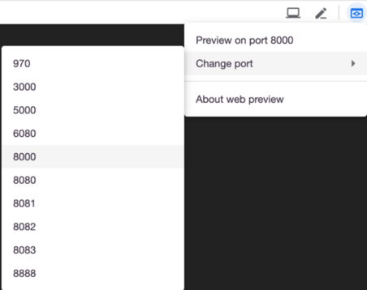

summary: Building GCP
id: building-gcp
categories: codelabs
tags: build 
status: Published 
authors: ChrisGuest
Feedback Link: mailto:chris.guest
<!-- copied from  -->

# Building CodeLabs in GCP
<!-- ------------------------ -->
## Overview 
Duration: 1

### Information  
Codelabs are a great way of walking new starters and employees through team processes and conventions.
The public [Codelabs](https://codelabs.developers.google.com/) can be used to learn anything from Tensorflow through to using Cloud APIs.

This repo builds the [Tools](https://github.com/googlecodelabs/tools) into a container that can be used to build a statically hosted image.  

Walking through these steps will allow you build your own container and add your own Codelabs.

### How it works
We use the [Codelabs](https://codelabs.developers.google.com/) to build a base container, passing it into a multistage build that processes markdown files to build a final static hosted web folder in an nginx container.  


<!-- ------------------------ -->
## Clone or fork the repo 
Duration: 10

### Fork
You can use github to fork the repo into your own account.  

Goto [https://github.com/chrisguest75/codelab_example](https://github.com/chrisguest75/codelab_example) and fork  

### Clone
```
git clone https://github.com/chrisguest75/codelab_example
```

NOTE: If you choose to clone the repo then you need to set a new origin by removing the old one.  
```
git remote remove origin     
git remote add origin git@github.com:<account>/<repo> 
git push
```

<!-- ------------------------ -->
## Build it locally
Duration: 15

### Building
To build the base container used to build the example codelabs.  The base container will use the [Codelabs](https://codelabs.developers.google.com/) repo. It will install some necessary tools (claat) and set a structure to process a set of markdown defined codelabs.  

```
./build_base.sh
```

To rebuild the codelabs using the base container.  It will also run and host on port 8000 for testing.

```
./build_codelabs.sh
```

Once running you'll need to map port 8000 using the preview on port feature of the GCP console.  
  

Now you should see a screen like the following.


<!-- ------------------------ -->
## Deploying local version
Duration: 15

### Pushing to GCR
We now retag the image for the GCR and push it.  Cloud Shell is already authed for me.  No docker login required.   
```
docker tag codelabs:latest gcr.io/open-source-01/codelab_example/codelabs_cloudshell:latest
docker push gcr.io/open-source-01/codelab_example/codelabs_cloudshell:latest
```

### Deploy to CloudRun
We can now deploy to Cloud Run.
```
gcloud beta run deploy codelabs --image gcr.io/open-source-01/codelab_example/codelabs_cloudshell:latest --region europe-west1 --platform managed 
```

<!-- ------------------------ -->
## Submit build to Cloud Build
Duration: 15

### Building
Building with Cloud Build 
```
gcloud builds submit --project open-source-01 --substitutions=COMMIT_SHA=test,BRANCH_NAME=cloudbuild,REPO_NAME=codelab_example
```


<!-- ------------------------ -->
## Congratulations
Duration: 5

### Key Skills
You have now build, hosted locally on the GCP console.

